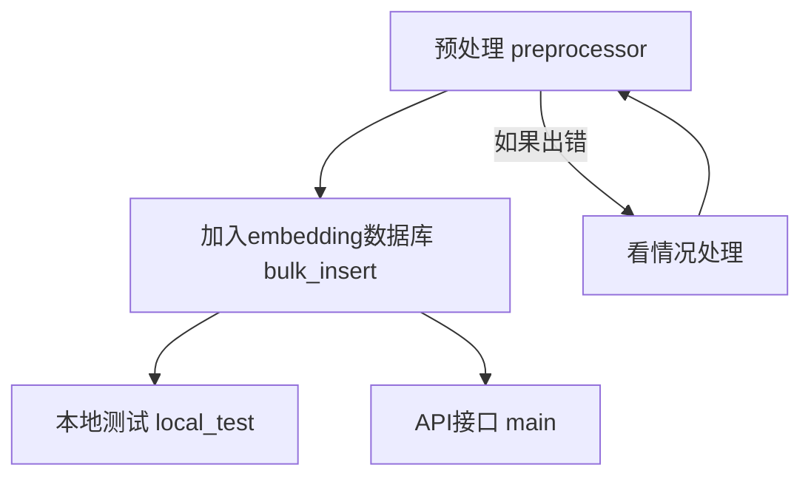

流程图:

```mermaid
graph TD;
    main["API接口 main"];
    preprocessor["预处理 preprocessor"];
    embedding["加入embedding数据库 bulk_insert"];
    local_test["本地测试 local_test"];
    
    preprocessor-->embedding;
    preprocessor-->|如果出错|看情况处理;
    看情况处理-->preprocessor;
    embedding-->local_test;
    embedding-->main;
```